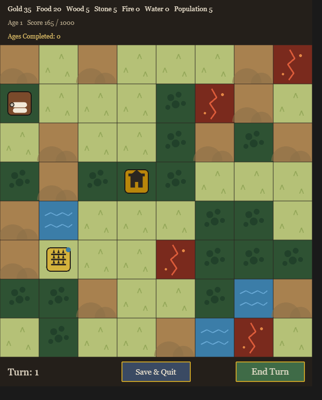

# Ember & Ashes

*A chill, open-source, browser-based fantasy kingdom strategy game.*

**[Play it live →](https://feiriccardo.github.io/ember-and-ashes/)**



## What is this?

Ember & Ashes is a turn-based, 4X-lite kingdom builder played on a small 8×8 grid. There's no timer and no real-time pressure — every action happens at your own pace, one turn at a time. Build up your kingdom, manage six resources and your population, defend against a rival AI kingdom, and survive random hazards. Eventually your kingdom's success becomes its undoing: once your score crosses a rising Destruction Threshold, a cataclysm levels the map and a new, harder **Age** begins. Small permanent bonuses carry forward, so each run makes the next one a little easier — a light rogue-lite loop layered on top of a cozy city-builder.

## Features

- **8×8 procedurally generated map** — five terrain types (Plains, Forest, Hills, River/Water, Volcanic) regenerated with a fresh seed at the start of every Age.
- **Seven resources** — Gold, Food, Wood, Stone, Fire, Water, and Population, all tracked live in the top bar.
- **Seven buildings** — Town Hall (always present, passive Gold trickle), Farm, Sawmill, Quarry, Forge, Market, and Watchtower, each with its own cost and terrain rules (Sawmill needs to be on or near Forest, Quarry needs Hills, Farm gets a bonus next to Water).
- **Population & Food loop** — population grows on Food surplus and shrinks on deficit, capped by how many Farms you've built.
- **A rule-based AI rival** — an off-map "kingdom" that manages its own economy and occasionally raids your weakest undefended tile, stealing resources and destroying a building. Build a Watchtower nearby to keep a tile safe.
- **Hazard events** — terrain-gated Fire and Flood events that damage or destroy buildings, with damaged buildings recovering automatically after a few turns.
- **Score, Destruction Threshold & Ages** — your score (population + buildings + banked resources) is checked against an exponentially rising threshold every turn; crossing it triggers a cataclysm that resets the map and starts a new, harder Age.
- **Prestige carry-over** — a small permanent Gold bonus and an Ages-completed counter persist across every reset.
- **Difficulty scaling** — the AI gets more aggressive, hazards get more frequent, and base income tapers slightly as Ages go by.
- **Save & load** — auto-saves to your browser's local storage at the end of every turn, plus a manual "Save & Quit," so you can close the tab and pick up exactly where you left off.
- **Installable PWA** — add it to your phone's home screen and it works offline after the first load.

## How to play

1. Click any empty tile to open the build menu, pick a building you can afford, and place it.
2. Click **End Turn** to advance — production, population growth, the AI's turn, hazard rolls, and your score are all resolved automatically.
3. Watch your resource bar and score. Build a Watchtower near anything valuable to protect it from raids.
4. When the cataclysm hits, don't panic — your kingdom resets, but you keep your Ages-completed count and a small permanent bonus, and the next Age starts fresh.

## Tech stack

- **Engine**: [Phaser 3](https://phaser.io/)
- **Language**: TypeScript
- **Build tool**: [Vite](https://vitejs.dev/)
- **Persistence**: browser `localStorage` (no backend)
- **Hosting**: static site on GitHub Pages, deployed automatically via GitHub Actions on every push to `main`

## Running it locally

```bash
npm install
npm run dev        # starts a dev server with hot reload
npm run build       # production build to dist/
npm run preview     # preview the production build locally
```

## Project structure

```
src/
  scenes/       Phaser scene(s) — GameBoardScene owns the grid, UI, and wiring between systems
  systems/      Game logic: TurnManager, ResourceSystem, PopulationSystem, ScoreSystem,
                PrestigeSystem, AIOpponent, HazardSystem, SaveSystem, MapGenerator,
                BuildingPlacement
  data/         Plain data definitions: terrain types, building definitions, resource list
public/         Static assets, PWA manifest, service worker
docs/adr/       Architecture Decision Records for the non-obvious calls made along the way
CONTEXT.md      Domain glossary — the project's shared vocabulary
documentation.md  The original game design document
.scratch/       Implementation tickets tracked as local markdown files
```

See [`docs/adr/`](docs/adr/) for the reasoning behind a few decisions that deliberately diverge from the original design doc (e.g. the AI kingdom has no presence on the grid, the player owns the whole map from turn one, and the game stayed strictly turn-based rather than going real-time).

## Known limitations

This is a v1 built around a specific, intentionally-scoped set of vertical slices — a few things from the original design are deliberately not here yet:

- **No unit training.** Soldier is referenced as a deterrence stat in the AI's own decision-making, but there's currently no way for the player to actually train one. The AI always treats player military strength as zero.
- **Well and Trader** were scoped out of v1 (see the building/unit lists above) in favor of keeping the early build lean.
- Building costs, score weights, and most other balance numbers are concrete but explicitly placeholder — they're tuned by feel, not extensive playtesting.

## License

[MIT](LICENSE)
